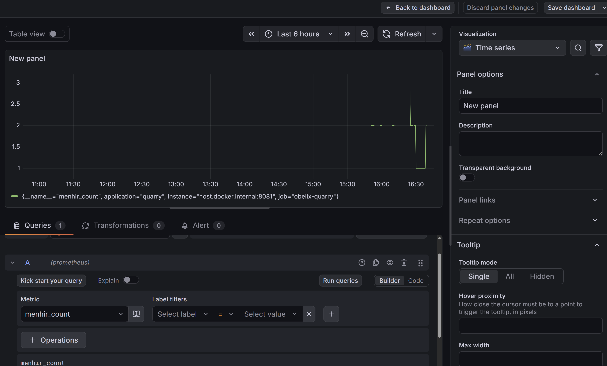

# Obelix & Co. Webshop 🪨

Currently, everything is under `obelix-webshop`, but we have great plans to split parts to split the most important part, my standing stones, into its own microservice.
Gradle subprojects are already in place, ready for the great change.

# Grafana Setup

1. run `docker-compose.yaml`
2. Open [http://localhost:3000/](http://localhost:3000/)
3. Login with 
   - User: admin 
   - Password: adin
4. Configure Datasource for `prometheus` with URL `http://obelix-prometheus-1:9090`
5. Set up a new Dashboard like this
